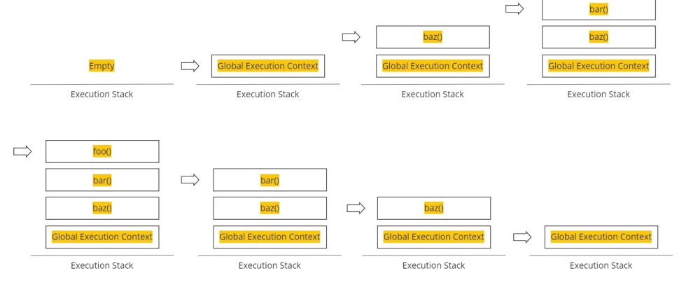

## Q3-Explain what is execution context in detail with diagram.

Execution context (EC) is defined as the environment in which the JavaScript code is executed. By environment, I mean the value of this, variables, objects, and functions JavaScript code has access to at a particular time.

Execution context in JavaScript is of three types as:-

1.Global execution context (GEC):- This is the default execution context in which JS code start its execution when the file first loads in the browser. All of the global code i.e. code which is not inside any function or object is executed inside the global execution context. GEC cannot be more than one because only one global environment is possible for JS code execution as the JS engine is single threaded.

2.Functional execution context (FEC):- Functional execution context is defined as the context created by the JS engine whenever it finds any function call. Each function has its own execution context. It can be more than one. Functional execution context has access to all the code of the global execution context though vice versa is not applicable. While executing the global execution context code, if JS engine finds a function call, it creates a new functional execution context for that function. In the browser context, if the code is executing in strict mode value of this is undefined else it is window object in the function execution context.

3.Eval:- Execution context inside eval function.

## diagram of execution part

